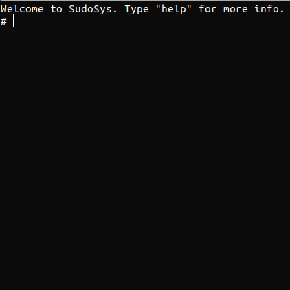
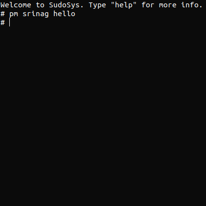
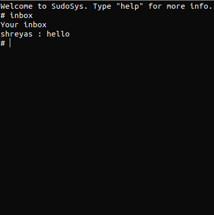

# SudoSys

This is a Networks Course Project,in which we achieve audio and messaging transfer between clients.

It contains private message,voice chat,broad cast applications

The server performs the role of ip,username resolution

###  The screenshot of the terminal on running the application



### Screenshot of sending private message 



### Screenshot on checking inbox



Steps to run the application

```
python3 server.py 
python3 client.py username password
```
Username,password is stored in the server.

## Requirements
- Only Pyaudio for voice chat